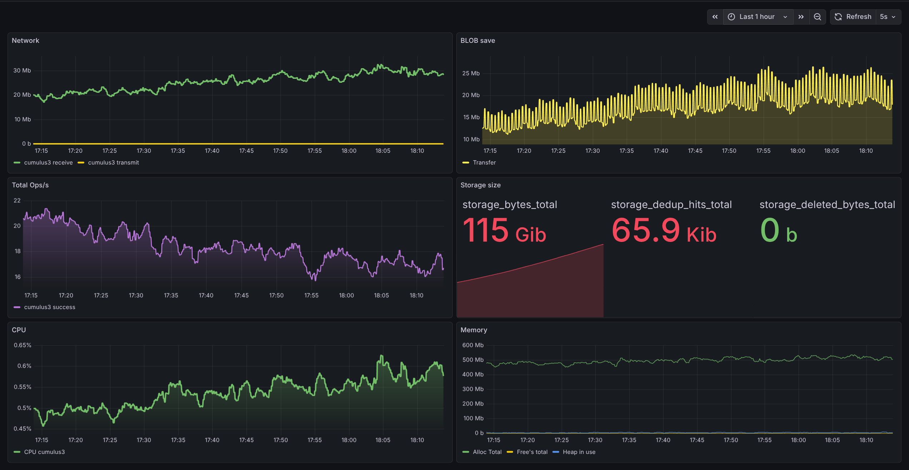

# Cumulus3

**Cumulus3** is a high-performance, distributed object storage server written in **Go**, designed for storing and serving millions of small files efficiently.

It is a modern implementation inspired by the **SeaweedFS** architecture (based on Facebook's Haystack paper). The primary goal is to provide extremely fast storage and retrieval for millions of small files, overcoming the inode limitations and metadata bottlenecks of traditional file systems.

## Table of Contents

- [Overview](#overview)
- [Key Features](#key-features)
- [Architecture](#architecture)
- [Technology Stack](#technology-stack)
- [Use Cases](#use-cases)
- [Installation](#installation)
  - [Prerequisites](#prerequisites)
  - [Development Setup](#development-setup)
  - [Production Deployment](#production-deployment)
- [Usage](#usage)
  - [API Endpoints](#api-endpoints)
  - [File Upload](#file-upload)
  - [File Download](#file-download)
  - [Image Processing](#image-processing)
  - [File Metadata](#file-metadata)
  - [File Deletion](#file-deletion)
- [Configuration](#configuration)
- [Maintenance Tools](#maintenance-tools)
- [Monitoring and Observability](#monitoring-and-observability)
- [Advanced Features](#advanced-features)
- [Documentation](#documentation)
- [License](#license)

## Overview



Cumulus3 is an object storage system specifically optimized for handling large volumes of small files (images, documents, media). Traditional file systems suffer from significant performance degradation when dealing with millions of small files due to:

- **Inode exhaustion** - limited number of files per volume
- **Metadata overhead** - each file requires separate metadata operations
- **Disk seek latency** - random access to many small files is slow
- **Fragmentation** - inefficient disk space utilization

Cumulus3 solves these problems by:

1. **Consolidating small files** into large append-only volume files (Haystack architecture)
2. **Content-based deduplication** using BLAKE2b-256 hashing to eliminate duplicate storage
3. **Adaptive compression** with Zstandard for optimal space utilization
4. **Efficient metadata management** using SQLite with WAL mode for high concurrency
5. **Built-in image processing** with on-the-fly thumbnail generation and resizing

## Key Features

### 🗄️ Efficient Storage (Haystack Architecture)

- **Volume-based storage**: Small files are merged into large "Volume" files (configurable size, default 10GB)
- **Append-only writes**: Sequential writes minimize disk seek latency
- **Efficient space utilization**: Eliminates per-file overhead and fragmentation
- **File descriptor optimization**: Dramatically reduces open file handles
- **Multiple volume management**: Automatic rotation when volumes reach size limit

### 🔍 Smart Content Deduplication

- **Automatic duplicate detection**: Uses BLAKE2b-256 cryptographic hashing
- **Streaming hash computation**: Content is hashed during upload without storing duplicates
- **Zero-copy deduplication**: When duplicate detected, only metadata reference is created
- **Significant space savings**: Eliminates redundant data automatically
- **Prometheus metrics**: Track deduplication hit rate and storage savings

### 🗜️ Adaptive Compression

- **Intelligent compression**: Uses state-of-the-art **Zstandard (Zstd)** algorithm
- **MIME-type aware**: Automatically compresses text, documents, and SVG files
- **Smart skip logic**: Avoids re-compressing already compressed formats (JPEG, PNG, MP4, ZIP, etc.)
- **Configurable modes**:
  - `Auto` - intelligent detection (default)
  - `Force` - compress everything
  - `Never` - disable compression
- **Compression threshold**: Only compress if space savings exceed configurable percentage (default 10%)

### 💾 Robust Metadata Management

- **SQLite database**: Embedded, zero-configuration, ACID-compliant database
- **WAL mode**: Write-Ahead Logging for optimal concurrency and crash recovery
- **Thread-safe operations**: Handles concurrent uploads efficiently
- **Optimized queries**: Indexes on hash, UUID, and legacy ID fields
- **Metadata logging**: Append-only log for disaster recovery scenarios

### 📷 Built-in Image Processing

- **On-the-fly image transformations**: Resize images without pre-generating variants
- **Multiple size variants**:
  - `thumb` - 150×150px thumbnails
  - `sm` - 400×400px small images
  - `md` - 800×800px medium images
  - `lg` - 1200×1200px large images
  - `orig` - original unmodified image
- **PDF thumbnail generation**: Automatic first-page preview for PDF documents
- **Format optimization**: Intelligent JPEG/PNG output selection
- **Quality optimization**: Adaptive quality based on target size
- **Aspect ratio preservation**: No cropping or distortion
- **LibVIPS acceleration**: Fast, memory-efficient image processing

### ⏱️ Temporary Storage

- **Built-in expiration**: Native support for file validity periods
- **Flexible time formats**: `1 hour`, `2 days`, `1 week`, `3 months`
- **Automatic cleanup**: Background job removes expired files
- **Perfect for temporary sharing**: File sharing services, temporary uploads, caching

### 📊 Observability & Monitoring

- **Prometheus metrics endpoint**: `/metrics` for monitoring and alerting
- **Comprehensive metrics**:
  - Upload throughput and latency
  - Deduplication hit/miss rates
  - Storage utilization per volume
  - Compression ratios
  - Active connections and request rates
- **Structured logging**: JSON format for log aggregation (Grafana Loki, ELK, Splunk)
- **Health check endpoint**: `/health` for load balancers and orchestration

### 🔄 Legacy System Migration

- **Old Cumulus ID mapping**: Maintains compatibility with previous Cumulus versions
- **Dual-path access**: Access files by new UUID or legacy numeric ID
- **Zero-downtime migration**: Gradual migration without service interruption

### 🛡️ Production-Ready

- **Docker deployment**: Complete Docker Compose
- **Horizontal scalability**: Multiple instances with shared storage backend
- **Graceful shutdown**: Proper cleanup and connection draining
- **Request size limits**: Configurable upload limits to prevent abuse
- **Error handling**: Comprehensive error responses with proper HTTP status codes

## Architecture

### Core Concepts

Cumulus3 separates **Logical Files** (user perspective) from **Physical Blobs** (actual stored data):

- **File**: Logical representation with UUID, filename, MIME type, tags, timestamps
- **Blob**: Physical data storage with hash, compression info, volume location
- **Volume**: Large container file (e.g., 10GB) holding multiple blobs
- **Metadata**: SQLite database tracking all relationships

### Storage Flow

```
1. Upload Request
   ↓
2. Stream to MultiWriter (Hash + Compress simultaneously)
   ↓
3. Calculate BLAKE2b-256 hash
   ↓
4. Check for existing blob with same hash
   ├─ Hash exists → Create file entry pointing to existing blob (DEDUP HIT)
   └─ Hash new → Write blob to volume + Create blob and file entries (DEDUP MISS)
   ↓
5. Return UUID to client
```

### Data Structures

**Files Table (files):**
- `file_id` - UUID (primary key)
- `blob_id` - Reference to physical blob
- `original_filename` - User's filename
- `mime_type` - Content type
- `tags` - Searchable tags (JSON array)
- `old_cumulus_id` - Legacy system ID
- `upload_date`, `validity` - Timestamps

**Blobs Table (blobs):**
- `blob_id` - Sequential ID (primary key)
- `hash_blake2b256` - Content hash (unique index)
- `compression_alg` - Compression type (0=none, 1=gzip, 2=zstd)
- `volume_id` - Which volume file contains this blob
- `offset` - Position in volume file
- `size_original` - Uncompressed size
- `size_compressed` - Stored size

**Volumes Metadata (volumes):**
- `volume_id` - Volume number
- `size_total` - Current volume size
- `size_active` - Active (non-deleted) data size
- `blob_count` - Number of blobs in volume

### Concurrency Model

- **Goroutines**: Each HTTP request handled in separate goroutine
- **Per-volume locking**: RWMutex per volume for concurrent reads, serialized writes
- **SQLite WAL mode**: Multiple readers, single writer without blocking readers
- **Atomic operations**: All metadata updates are transactional

## Technology Stack

| Component | Technology | Purpose |
|-----------|-----------|---------|
| **Language** | Go 1.25+ | High-performance, concurrent backend |
| **Database** | SQLite 3 (WAL mode) | Embedded metadata storage |
| **Hashing** | BLAKE2b-256 | Fast, secure content hashing |
| **Compression** | Zstandard (Zstd) | Modern, high-ratio compression |
| **Image Processing** | libvips (via bimg) | Fast, memory-efficient transformations |
| **PDF Processing** | libvips (via bimg) | PDF to image conversion |
| **API Documentation** | Swagger/OpenAPI | Interactive API documentation |
| **Metrics** | Prometheus | Monitoring and alerting |
| **Logging** | Structured logging (JSON/text) | Centralized log aggregation |
| **Container** | Docker + Docker Compose | Deployment and orchestration |
| **Web Server** | Go net/http | Built-in HTTP server |
| **Reverse Proxy** | Nginx (optional) | SSL termination, load balancing |

## Use Cases

Cumulus3 is ideal for:

- **Image hosting platforms** - Social networks, photo galleries, avatar systems
- **Document management systems** - PDF storage, document sharing, archives
- **Media asset storage** - Video thumbnails, audio files, media libraries
- **Content Delivery Networks (CDN)** - Origin storage for CDN distribution
- **File sharing services** - Temporary and permanent file hosting
- **Backup systems** - Deduplicated backup storage
- **CMS backends** - WordPress, Drupal media storage
- **IoT data storage** - Sensor data, device logs, images from cameras
- **E-commerce platforms** - Product images, user uploads, receipts

## Installation

### Prerequisites

#### For Development:

- **Go**: Version 1.25 or higher ([download](https://go.dev/dl/))
- **GCC/G++**: Required for SQLite CGO bindings
  ```bash
  # Ubuntu/Debian
  sudo apt-get install build-essential
  
  # macOS
  xcode-select --install
  ```
- **libvips**: For image processing (optional but recommended)
  ```bash
  # Ubuntu/Debian
  sudo apt-get install libvips-dev
  
  # macOS
  brew install vips
  ```

#### For Production:

- **Docker**: Version 20.10+ ([install](https://docs.docker.com/engine/install/))
- **Docker Compose**: V2+ (included with Docker Desktop)
- **Linux server**: Ubuntu 20.04+ recommended
- **Minimum resources**: 2GB RAM, 10GB disk space

### Development Setup

1. **Clone the repository:**
   ```bash
   git clone https://github.com/pmalasek/cumulus3.git
   cd cumulus3
   ```

2. **Install dependencies:**
   ```bash
   go mod download
   ```

3. **Create environment configuration:**
   ```bash
   cp .env.example .env
   # Edit .env with your settings
   nano .env
   ```

4. **Build the application:**
   ```bash
   # Build main server
   go build -o build/volume-server ./src/cmd/volume-server
   
   # Build maintenance tools
   go build -o build/compact-tool ./src/cmd/compact-tool
   go build -o build/recovery-tool ./src/cmd/recovery-tool
   go build -o build/rebuild-db ./src/cmd/rebuild-db
   ```

5. **Run the server:**
   ```bash
   ./build/volume-server
   ```

6. **Access the application:**
   - API: <http://localhost:8800>
   - Swagger UI: <http://localhost:8800/docs/>
   - Health check: <http://localhost:8800/health>
   - Metrics: <http://localhost:8800/metrics>

### Production Deployment

#### Using Docker Compose (Recommended):

1. **Clone and configure:**
   ```bash
   git clone https://github.com/pmalasek/cumulus3.git
   cd cumulus3
   cp .env.production .env
   ```

2. **Edit configuration:**
   ```bash
   nano .env
   ```
   
   Key settings:
   ```bash
   SERVER_PORT=8800
   DATA_FILE_SIZE=10GB              # Volume size
   MAX_UPLOAD_FILE_SIZE=500MB       # Max upload
   USE_COMPRESS=Auto                # Compression mode
   LOG_LEVEL=INFO                   # Production log level
   LOG_FORMAT=json                  # Structured logging
   ```

3. **Start the stack:**

   ```bash
   docker-compose up -d
   ```
   
   This starts:
   - Cumulus3 server (port 8800)

4. **Verify deployment:**

   ```bash
   # Check container status
   docker-compose ps
   
   # View logs
   docker-compose logs -f cumulus3
   
   # Test health endpoint
   curl http://localhost:8800/health
   ```

5. **Access services:**
   - Cumulus3 API: <http://your-server:8800>
   - Swagger docs: <http://your-server:8800/docs/>
   - Prometheus: <http://your-server:9090>

#### SSL/TLS Configuration:

For HTTPS in production, use Nginx or a reverse proxy:

```nginx
server {
    listen 443 ssl http2;
    server_name storage.example.com;
    
    ssl_certificate /path/to/cert.pem;
    ssl_certificate_key /path/to/key.pem;
    
    client_max_body_size 500M;
    
    location / {
        proxy_pass http://localhost:8800;
        proxy_set_header Host $host;
        proxy_set_header X-Real-IP $remote_addr;
        proxy_set_header X-Forwarded-For $proxy_add_x_forwarded_for;
        proxy_set_header X-Forwarded-Proto $scheme;
    }
}
```

See [DEPLOYMENT.md](DEPLOYMENT.md) for complete production deployment guide including:
- SSL/TLS setup with Let's Encrypt
- Nginx configuration
- Load balancing
- Backup strategies
- Monitoring setup

## Usage

### API Endpoints

Cumulus3 provides a RESTful API for all operations. Complete API documentation is available via Swagger UI at `/docs/`.

#### Endpoint Categories:

- **Base API** (`/base/*`) - Legacy compatibility endpoints
- **Files API** (`/v2/files/*`) - Main file operations
- **Images API** (`/v2/images/*`) - Image processing and thumbnails
- **System API** (`/health`, `/metrics`) - System status and monitoring

### File Upload

Upload a file to Cumulus3:

**Endpoint:** `POST /v2/files/upload`

**cURL Example:**
```bash
curl -X POST http://localhost:8800/v2/files/upload \
  -F "file=@/path/to/image.jpg" \
  -F "tags=photo,vacation,2023" \
  -F "validity=7 days"
```

**Python Example:**
```python
import requests

url = "http://localhost:8800/v2/files/upload"
files = {'file': open('image.jpg', 'rb')}
data = {
    'tags': 'photo,vacation,2023',
    'validity': '7 days'
}

response = requests.post(url, files=files, data=data)
result = response.json()
file_id = result['fileID']
print(f"Uploaded file ID: {file_id}")
```

**Response:**
```json
{
  "fileID": "550e8400-e29b-41d4-a716-446655440000"
}
```

**Parameters:**
- `file` (required) - File to upload (multipart/form-data)
- `tags` (optional) - Comma-separated tags or JSON array
- `old_cumulus_id` (optional) - Legacy system ID for migration
- `validity` (optional) - Expiration period (e.g., "1 hour", "7 days", "1 month")

### File Download

Download a file by its UUID:

**Endpoint:** `GET /v2/files/{uuid}`

**cURL Example:**
```bash
curl -O http://localhost:8800/v2/files/550e8400-e29b-41d4-a716-446655440000
```

**Browser:**
```
http://localhost:8800/v2/files/550e8400-e29b-41d4-a716-446655440000
```

**Response:**
- HTTP 200: File content with proper Content-Type header
- HTTP 404: File not found
- HTTP 410: File expired (when validity exceeded)

### Image Processing

Get resized images and thumbnails on-the-fly:

**Endpoint:** `GET /v2/images/{uuid}?variant={size}`

**Size Variants:**
- `orig` - Original image (no resizing)
- `thumb` - 150×150px thumbnail
- `sm` - 400×400px small
- `md` - 800×800px medium
- `lg` - 1200×1200px large

**Examples:**
```bash
# Original image
curl http://localhost:8800/v2/images/550e8400-e29b-41d4-a716-446655440000?variant=orig

# Thumbnail
curl http://localhost:8800/v2/images/550e8400-e29b-41d4-a716-446655440000?variant=thumb

# Medium size
curl http://localhost:8800/v2/images/550e8400-e29b-41d4-a716-446655440000?variant=md
```

**HTML Image Gallery:**
```html


```

**Features:**
- Aspect ratio preserved (no cropping)
- Images never upscaled beyond original size
- PDF files: automatic first-page thumbnail
- Cached headers for browser caching
- Efficient memory usage with streaming

### File Metadata

Get file information without downloading:

**Endpoint:** `GET /v2/files/info/{uuid}`

**cURL Example:**
```bash
curl http://localhost:8800/v2/files/info/550e8400-e29b-41d4-a716-446655440000
```

**Response:**
```json
{
  "fileID": "550e8400-e29b-41d4-a716-446655440000",
  "filename": "vacation-photo.jpg",
  "mimeType": "image/jpeg",
  "size": 2457600,
  "uploadDate": "2023-12-13T10:30:00Z",
  "tags": ["photo", "vacation", "2023"],
  "validity": "2023-12-20T10:30:00Z",
  "hash": "a1b2c3d4e5f6...",
  "compressed": true,
  "compressionRatio": 0.85
}
```

### File Deletion

Delete a file by UUID:

**Endpoint:** `DELETE /v2/files/delete/{uuid}`

**cURL Example:**
```bash
curl -X DELETE http://localhost:8800/base/files/delete/550e8400-e29b-41d4-a716-446655440000
```

**Response:**
- HTTP 200: File deleted successfully
- HTTP 404: File not found

**Note:** Physical blob data is marked as deleted but not immediately removed. Use the compact tool to reclaim space.

### Legacy API Support

For migration from old Cumulus versions:

**Download by old ID:**
```bash
curl http://localhost:8800/base/files/id/12345
```

**Metadata by old ID:**
```bash
curl http://localhost:8800/base/files/info/12345
```

## Configuration

Configuration is managed through environment variables or `.env` file:

### Core Settings

```bash
# Server Configuration
SERVER_ADDRESS=0.0.0.0          # Bind address (0.0.0.0 for all interfaces)
SERVER_PORT=8800                # HTTP port

# Storage Configuration
DB_PATH=/app/data/database/cumulus3.db  # SQLite database path
DATA_DIR=/app/data/volumes      # Volume files directory
DATA_FILE_SIZE=10GB             # Maximum size per volume file
MAX_UPLOAD_FILE_SIZE=500MB      # Maximum upload size

# Compression Settings
USE_COMPRESS=Auto               # Auto | Force | Never
MINIMAL_COMPRESSION=10          # Minimum compression gain (%)

# Logging
LOG_LEVEL=INFO                  # DEBUG | INFO | WARN | ERROR
LOG_FORMAT=json                 # text | json
LOG_COLOR=false                 # ANSI colors (true for dev, false for prod)

# Cleanup
CLEANUP_INTERVAL=1h             # How often to check for expired files

# API Documentation
SWAGGER_HOST=localhost:8800     # Host for Swagger UI
```

### Size Format

Size values support human-readable formats:
- Bytes: `1024`, `2048`
- Kilobytes: `1KB`, `512KB`
- Megabytes: `10MB`, `500MB`
- Gigabytes: `1GB`, `10GB`

### Compression Modes

- **Auto** (recommended): Compresses based on MIME type detection
- **Force**: Compress all files regardless of type
- **Never**: Disable compression entirely

### Log Levels

- **DEBUG**: Verbose logging (development only)
- **INFO**: Standard operational logs (recommended for production)
- **WARN**: Warnings and errors
- **ERROR**: Only errors

See [LOGGING.md](LOGGING.md) for detailed logging documentation.

## Maintenance Tools

Cumulus3 includes several maintenance tools for database optimization and disaster recovery.

### Compact Tool

Reclaim space from deleted files and optimize volumes:

**List volumes:**
```bash
./build/compact-tool volumes list
```

Output:
```
Volume ID | Size (MB) | Active (MB) | Blobs | Fragmentation
----------|-----------|-------------|-------|---------------
        1 |   5234.56 |     4123.45 |  1234 |        21.23%
        2 |   8765.43 |     8765.43 | 23456 |         0.00%
        3 |   3456.78 |     2345.67 |   567 |        32.15%
```

**Compact specific volume:**
```bash
./build/compact-tool volumes compact 1
```

**Compact all fragmented volumes:**
```bash
./build/compact-tool volumes compact-all --threshold 20
```

**Database VACUUM (requires downtime):**
```bash
# Stop the server first
docker-compose stop cumulus3

# Run VACUUM
docker exec cumulus3-volume-server-1 /app/compact-tool db vacuum

# Start the server
docker-compose start cumulus3
```

**Docker usage:**
```bash
# List volumes (server can be running)
docker exec cumulus3 /app/compact-tool volumes list

# Compact fragmented volumes
docker exec cumulus3 /app/compact-tool volumes compact-all --threshold 30
```

### Recovery Tool

Recover files from volume files when database is corrupted:

```bash
./build/recovery-tool \
  -src ./data \
  -dst ./restored
```

This scans all `volume_*.dat` files and `files_metadata.bin` log to reconstruct files.

### Rebuild Database Tool

Rebuild SQLite database from volume files and metadata logs:

```bash
./build/rebuild-db \
  -data ./data \
  -db ./data/database/cumulus3_new.db
```

See [REBUILD-DB.md](REBUILD-DB.md) for detailed recovery procedures.

## Monitoring and Observability

### Prometheus Metrics

Cumulus3 exposes comprehensive metrics at `/metrics`:

**Storage Metrics:**
- `cumulus_storage_size_bytes{volume}` - Size per volume
- `cumulus_storage_files_total` - Total files stored
- `cumulus_storage_blobs_total` - Total unique blobs

**Performance Metrics:**
- `cumulus_http_requests_total{endpoint,method,status}` - Request count
- `cumulus_upload_duration_seconds` - Upload latency histogram
- `cumulus_download_duration_seconds` - Download latency histogram

**Deduplication Metrics:**
- `cumulus_dedup_hits_total` - Duplicate files detected
- `cumulus_dedup_misses_total` - New unique files
- `cumulus_dedup_bytes_saved` - Total bytes saved by deduplication

**Compression Metrics:**
- `cumulus_compression_ratio` - Average compression ratio
- `cumulus_compressed_bytes_saved` - Bytes saved by compression

### Health Checks

**Endpoint:** `GET /health`

**Response:**
```json
{
  "status": "healthy",
  "database": "connected",
  "uptime": "24h15m30s",
  "version": "3.0.1"
}
```

Use for:
- Load balancer health checks
- Kubernetes liveness/readiness probes
- Monitoring systems

### Logging

Structured logging with multiple output formats:

**JSON format** (production):
```json
{
  "timestamp": "2023-12-13T10:30:00Z",
  "level": "INFO",
  "component": "UPLOAD",
  "message": "File uploaded successfully",
  "uuid": "550e8400-e29b-41d4-a716-446655440000",
  "size": 2457600,
  "dedup": "miss",
  "remote_addr": "192.168.1.100"
}
```

**Text format** (development):
```
2023-12-13 10:30:00 [INFO] UPLOAD: File uploaded successfully 
  uuid=550e8400-e29b-41d4-a716-446655440000 size=2457600 dedup=miss
```

Integration with log aggregation:
- Grafana Loki
- Elasticsearch (ELK Stack)
- Splunk
- Datadog

See [LOGGING.md](LOGGING.md) for complete logging documentation.

## Advanced Features

### Content Deduplication Details

Cumulus3 uses BLAKE2b-256 for content-addressable storage:

1. **Upload stream** → Hash calculation + Compression (parallel)
2. **Hash lookup** in blobs table (indexed)
3. **If exists**: Create file entry → Existing blob (instant)
4. **If new**: Write to volume → Create blob + file entries

**Benefits:**
- Zero storage for duplicate content
- Instant upload for duplicates (no disk I/O)
- Cryptographically secure (birthday attack resistance)
- Fast hash computation (optimized for speed)

### Volume Management

**Automatic rotation:**
- When volume reaches `DATA_FILE_SIZE`, new volume created
- Writes continue to new volume seamlessly
- Old volumes remain read-only

**Manual rotation:**
```go
// Trigger manual rotation
store.RecalculateCurrentVolume()
```

**Volume file format:**
```
volume_00000001.dat  # New format (8-digit padding)
volume_00000002.dat
volume_1.dat         # Legacy format (still supported)
```

### Space Reuse After Compaction

After deleting files and compacting:

```bash
# Compact volumes
./build/compact-tool volumes compact-all --threshold 20

# Server automatically detects freed space and reuses volumes
# No restart required!
```

See [SPACE-REUSE.md](SPACE-REUSE.md) for detailed space management documentation.

### Migration from Old Cumulus

Cumulus3 supports gradual migration:

1. **Map old IDs during upload:**
   ```bash
   curl -X POST http://localhost:8800/v2/files/upload \
     -F "file=@image.jpg" \
     -F "old_cumulus_id=12345"
   ```

2. **Access by old ID:**
   ```bash
   curl http://localhost:8800/base/files/id/12345
   ```

3. **Dual access** works simultaneously (UUID and old ID)

See [MIGRATION.md](MIGRATION.md) for complete migration guide.

## Documentation

Comprehensive documentation available:

- **[DEPLOYMENT.md](DEPLOYMENT.md)** - Production deployment, Docker, Nginx, SSL
- **[LOGGING.md](LOGGING.md)** - Logging configuration, formats, aggregation
- **[REBUILD-DB.md](REBUILD-DB.md)** - Database recovery procedures
- **[MIGRATION.md](MIGRATION.md)** - Migration from Cumulus 1.x/2.x
- **[SPACE-REUSE.md](SPACE-REUSE.md)** - Space management after compaction
- **[CHANGELOG-LOGGING.md](CHANGELOG-LOGGING.md)** - Logging system changelog
- **[Swagger UI](http://localhost:8800/docs/)** - Interactive API documentation

## Performance Characteristics

**Typical performance** (on modern hardware):

- **Upload throughput**: 500-1000 files/second (small files)
- **Download throughput**: 2000-5000 requests/second (cached)
- **Deduplication overhead**: <5ms per file
- **Image resize**: 10-50ms depending on size
- **Storage overhead**: <1% (metadata + volume headers)

**Scalability:**
- **Files**: Tested with 100+ million files
- **Storage**: Petabyte-scale capable
- **Concurrent uploads**: Limited by CPU cores and disk I/O
- **Horizontal scaling**: Multiple instances with shared storage

## Troubleshooting

### Common Issues

**Problem:** "Database is locked"
- **Cause:** Multiple processes accessing database
- **Solution:** Use only one server instance per database, or enable WAL mode (automatic)

**Problem:** High memory usage during uploads
- **Cause:** Large file uploads
- **Solution:** Adjust `MAX_UPLOAD_FILE_SIZE` or add more RAM

**Problem:** Slow image processing
- **Cause:** libvips not installed
- **Solution:** Install libvips development libraries

**Problem:** Files not found after restart
- **Cause:** Data directory not persistent
- **Solution:** Use Docker volumes or ensure data directory is mounted

## Contributing

Contributions are welcome! Please:

1. Fork the repository
2. Create a feature branch
3. Make your changes with tests
4. Submit a pull request

## License

Licensed under the Apache License, Version 2.0. See [LICENSE](LICENSE) file for details.

---

**Project:** Cumulus3  
**Version:** 3.0.1  
**Author:** Petr Malásek  
**Repository:** <https://github.com/pmalasek/cumulus3>
